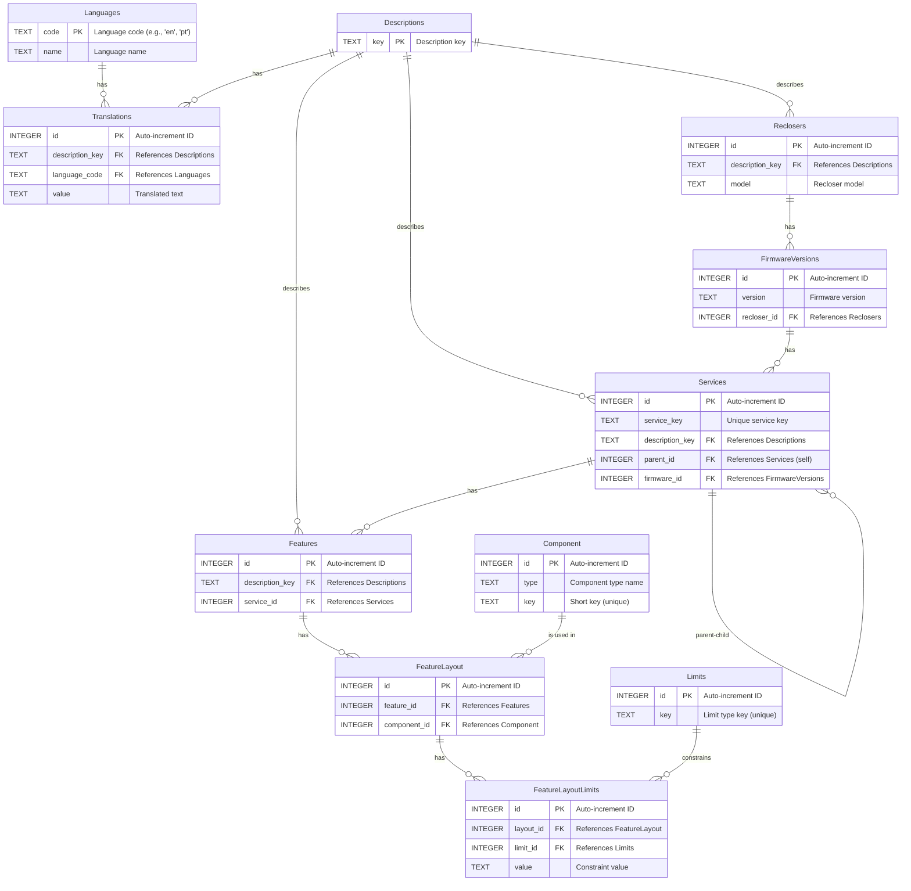
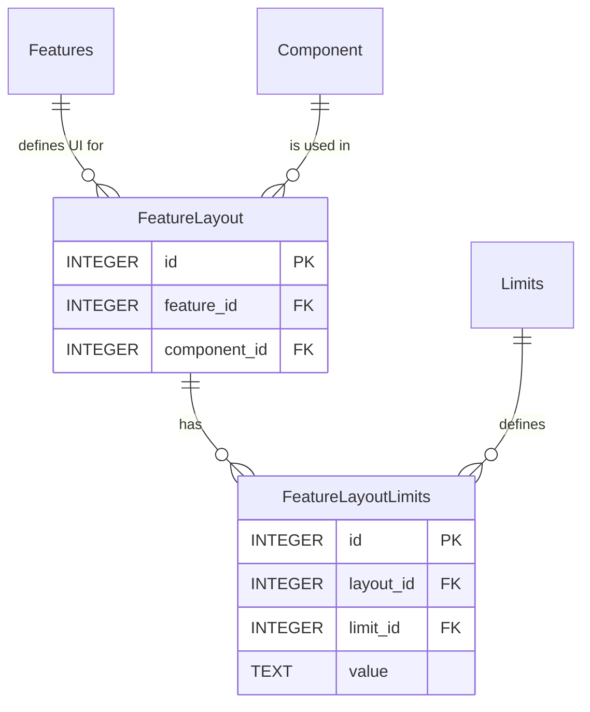

# Database Schema - Entity Relationship Diagram

## Complete Schema Overview



## UI Component Layout Tables



## Table Relationships Summary

### Core Schema

- **Languages** → **Translations** (1:N)
- **Descriptions** → **Translations** (1:N)
- **Descriptions** → **Reclosers** (1:N)
- **Descriptions** → **Services** (1:N)
- **Descriptions** → **Features** (1:N)
- **Reclosers** → **FirmwareVersions** (1:N)
- **FirmwareVersions** → **Services** (1:N)
- **Services** → **Services** (1:N, self-referencing)
- **Services** → **Features** (1:N)

### UI Layout Schema

- **Features** → **FeatureLayout** (1:N)
- **Component** → **FeatureLayout** (1:N)
- **FeatureLayout** → **FeatureLayoutLimits** (1:N)
- **Limits** → **FeatureLayoutLimits** (1:N)

## SQL Schema Definition

### Component Table

```sql
CREATE TABLE IF NOT EXISTS Component (
    id INTEGER PRIMARY KEY AUTOINCREMENT,
    type TEXT NOT NULL,
    key TEXT UNIQUE NOT NULL
);
```

### Limits Table

```sql
CREATE TABLE IF NOT EXISTS Limits (
    id INTEGER PRIMARY KEY AUTOINCREMENT,
    key TEXT UNIQUE NOT NULL
);
```

## Default Data

### Component Types

| id | type | key |
| :--- | :--- | :--- |
| 1 | ComboBox | cb |
| 2 | TextField | tf |
| 3 | Decimal | dec |
| 4 | Integer | int |
| 5 | Date | date |
| 6 | Time | time |
| 7 | DateTime | dt |

### Limit Types

| id | key |
| :--- | :--- |
| 1 | MIN_VALUE |
| 2 | MAX_VALUE |
| 3 | DEFAULT_VALUE |
| 4 | STEP |
| 5 | MAX_CHAR |

---

**Generated:** 2026-02-02  
**Schema Version:** 1.1.0
